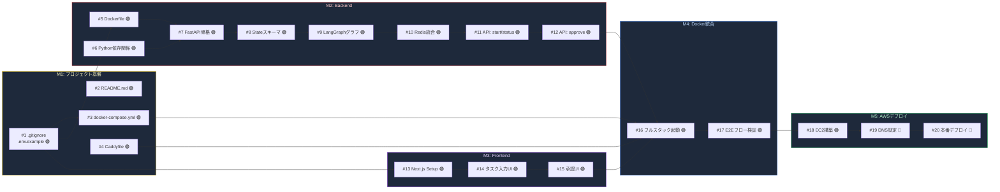

# AxonRelay / core

AI Agent Orchestration with Human-in-the-Loop — コアシステム

---

## Phase 1 Roadmap

> 🔴 Not Started  🟡 In Progress  🟢 Done



### 進捗

**M1 → M2/M3 (並行可) → M4 → M5** の順に進行します。

| Milestone | 内容 | Issue | 状態 |
|-----------|------|-------|------|
| **M1: プロジェクト基盤** | Docker/リバプロ/環境変数の土台 | #1 #2 #3 #4 | 🟢 |
| **M2: Backend** | FastAPI + LangGraph + Redis | #5 #6 #7 #8 #9 #10 #11 #12 | 🟢 |
| **M3: Frontend** | Next.js 人間介入ダッシュボード | #13 #14 #15 | 🟢 |
| **M4: Docker統合** | フルスタック起動 + E2E検証 | #16 #17 | 🟢 |
| **M5: AWSデプロイ** | EC2 + DNS + SSL + 本番稼働 | #18 #19 #20 | 🟡 (#18 完了) |

### 現在地

> **#18 EC2構築完了。次は #20 本番デプロイ (IP直アクセスで動作確認) → #19 DNS設定**

---

## Quick Start

```bash
git clone https://github.com/AxonRelay/core.git
cd core
cp .env.example .env
docker compose up --build
```

http://localhost でダッシュボードが表示されます。

---

## Architecture

```
Browser ──▶ Caddy (:80) ──┬──▶ /api/* ──▶ Backend (FastAPI :8000)
                           │                    │
                           │                    ▼
                           │               Redis (checkpoint)
                           │
                           └──▶ /*     ──▶ Frontend (Next.js :3000)
```

| Service | Role |
|---------|------|
| **Caddy** | リバースプロキシ。ローカルはHTTP、本番は自動HTTPS |
| **Backend** | FastAPI + LangGraph。タスク管理とHuman-in-the-Loop |
| **Frontend** | Next.js ダッシュボード。タスク投入・承認UI |
| **Redis** | LangGraphのステート永続化 (checkpoint) |

---

## API

| Method | Path | Description |
|--------|------|-------------|
| `GET` | `/api/` | ヘルスチェック |
| `POST` | `/api/task/start` | タスク開始。AI がドラフトを生成し承認待ちで停止 |
| `GET` | `/api/task/{thread_id}` | タスク状態の取得 |
| `POST` | `/api/task/approve` | ドラフトを修正(任意)して承認、処理を再開 |

### フロー

```
POST /task/start  ──▶  AI generates draft  ──▶  status: waiting_approval
                                                        │
                                              Human reviews & edits
                                                        │
POST /task/approve ──▶  Resume with updated draft ──▶  status: completed
```

---

## Environment Variables

| Variable | Default | Description |
|----------|---------|-------------|
| `CADDY_SITE_ADDRESS` | `:80` | ローカル: `:80`、本番: `yourdomain.com` (自動HTTPS) |
| `OPENAI_API_KEY` | — | LLM機能に必要 (現在はダミーレスポンス) |
| `REDIS_URL` | `redis://redis:6379` | docker-compose内ではデフォルトで接続可能 |

---

## Links

- [Project Board](https://github.com/orgs/AxonRelay/projects/1)
